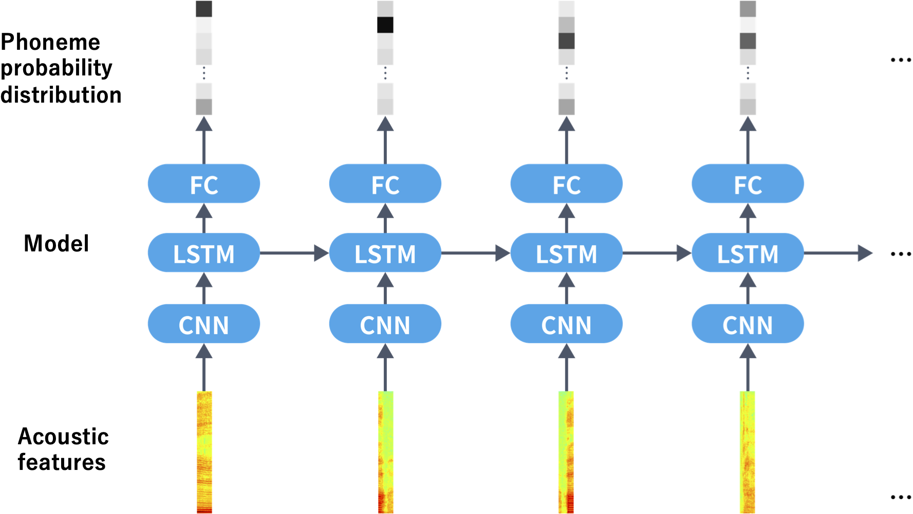
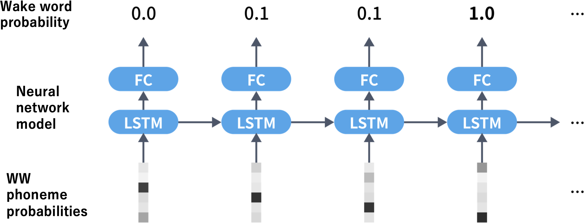

# WakeWord detection system

## Info 
- Developer: Ryota Nishimura, Takaaki Uno, Taiki Yamamoto, Norihide Kitaoka

## Model Configuration
- first stage: Phoneme Predictor
    - Input: 80-dimensional MFCCs
    - Output: 49 different phoneme probability distributions
- second stage: Phoneme Sequence Detector
    - Input: Phoneme probability distribution in 49 dimensions
    - Picking out phoneme probability distribution for user’s WW
    - Output: 2 dimentional label, 0: WW was not detected, 1: detected.

Phoneme Predictor:

Phoneme Sequence Detector:

## USAGE

### Phoneme Predictor
Follow the recipe for the CSJ corpus speech recognition task on ESPnet2.

Copy the data in the PhonemePredictor directory of this repository to ESPnet2 using the same hierarchical structure.

### Phoneme Sequence Detector
See README.md in the PhonemeSequenceDetector directory

